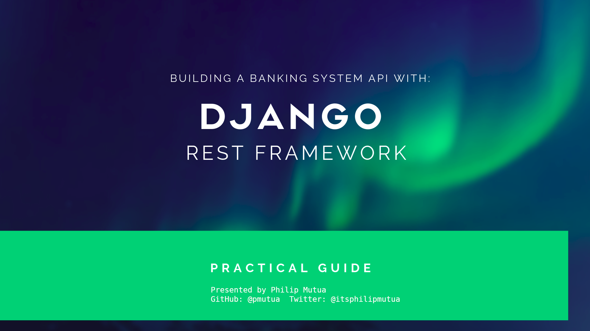

# Build a Banking System API with DJANGO Restframework


We're going to take you step-by-step to build a modern, fully open-source,Banking System RESTful API using Python, Django Rest Framework.

This course will teach you exactly how to build one with Django, Python, Django Rest Framework, and more.

### Section 1| Django start project
*1 - Requirements: no code*

Prerequisites required include:

- Python 3
- Pip 3
- Virtualenv
- Django == 3.2.9

#### Django Installation Instructions

* Make directory in your workspace:
  `mkdir banksystem_project`

* Navigate into `banksystem_project`

  `cd banksystem_project`

* Create a python virtual environment to install django and other dependecies in the future.

  `virtualenv .env`

  `.env` is the directory where we install the packages.

* Activate the virtual environment.

  `source .env/bin/activate`

* Install Django framework. We are going to use `django=1.11` in this tutorial.

  `pip3 install django==3.2.9`

OR 

  `pip install django==3.2.9` _If python3 is the default version running._

* Create django project:
  
  `django-admin startproject banksystem`
 

> That's it !!!!! You did it  :smiley: :clap: :clap: 

If you want to see the blank project we created follow the link below.

[1 - Blank Django Project](../../tree/96f545b069e1995c2662529f2d2e0decc1c4281c/)


Now lets create an application called `api` inside our project `banksystem`. [To learn more about django applications.](https://docs.djangoproject.com/en/2.1/ref/applications/)

[2 - Create api app](../../tree/084d648c94b0f11c89cbbcd930e2fce6e3687109/)

Run the following command in your root folder where `manage.py` lives.

`./manage.py startapp api`

The app `api` will be created and your whole project folder structure should look like this.

```markdown 

[banksystem_project]/
├── [banksystem]/
│   ├── __init__.py
│   ├── settings.py
│   ├── urls.py
│   └── wsgi.py
|____[api]/
|    |__ __init__.py
|    |__ models.py
|    |__ views.py
|    |__[migrations]/
|    |  |___ __init__.py
|    |
|    |__admin.py
|    |__tests.py
|
└── manage.py
```

Include `api` application in django `settings.py`

```
  INSTALLED_APPS = [
  'django.contrib.admin',
  'django.contrib.auth',
  'django.contrib.contenttypes',
  'django.contrib.sessions',
  'django.contrib.messages',
  'django.contrib.staticfiles',
  'api',
]

```

[Learn about django project structure.](https://django-project-skeleton.readthedocs.io/en/latest/structure.html)

### Section 2| Django Rest Framework

*1 - Introduction: no code*

[2 - Install Django Rest Framework](../../tree/63ae3a627606d74c9e4f6128ccd1ec686104585a/)

Install using `pip` ...

```
pip install djangorestframework====3.12.4
pip install Markdown==3.3.6      # Markdown support for the browsable API.
pip install django-filter==21.1  # Filtering support
```

Add `'rest_framework'` to your `INSTALLED_APPS` setting in `settings.py`.

```
INSTALLED_APPS = (
    ...
    'rest_framework',
)
```

If you're intending to use the browsable API you'll probably also want to add REST framework's login and logout views. Add the following to your root`urls.py` file. Location of **urls.py** `banksystem_project/banksystem/urls.py` 

```
urlpatterns = [
    ...
    url(r'^api-auth/', include('rest_framework.urls'))
]
```

Note that the URL path can be whatever you want.

[3 - Creating Bank System Models](../../tree/bc2272e009fa1dcb8719155d5b603b74c9e02e74/)

[4 - Creating Serailizers](../../tree/93b845ccda9d5430dd5e447ec250f5a883d3a55f/)

<!-- [6 - Create & Update through Serializers](../../tree/add_commit_here/)

[7 - Validation & Fields](../../tree/add_commit_here/)

[8 - API Endpoints Overview](../../tree/add_commit_here/)

[9 - List & Search API View](../../tree/add_commit_here/)

[10 - Create API View](../../tree/add_commit_here/)

[11 - Detail API View](../../tree/add_commit_here/)

[12 - Update & Delete API Views](../../tree/add_commit_here/)

[13 - Mixins to Power Http Methods](../../tree/add_commit_here/)

[14 - One API Endpoint for CRUDL](../../tree/add_commit_here/)

[15 - One API Endpoint for CRUDL Part 2](../../tree/add_commit_here/)

[16 - Uploading & Handling Images](../../tree/add_commit_here/)

[17 - 2 Views for CRUDL](../../tree/add_commit_here/)

[18 - Authentication & Permissions](../../tree/add_commit_here/) -->
<!-- 
[19 - Global Settings for Authentication & Permissions](../../tree/add_commit_here/)

[20 - Permission Tests with Python Requests](../../tree/add_commit_here/)

[21 - Implement JWT Authentication](../../tree/add_commit_here/)

[22 - JWT Authorization Header](../../tree/add_commit_here/)

[23 - Custom JWT Response Payload Handler](../../tree/add_commit_here/)

[24 - Custom Authentication View](../../tree/add_commit_here/)

[25 - Register API View](../../tree/add_commit_here/)

[26 - User Register Serializer](../../tree/add_commit_here9/)

[27 - Serializer Method Field](../../add_commit_here/)

[28 - Get Context Data](../../tree/add_commit_here/)

[29 - Custom Permissions](../../tree/add_commit_here/)

[30 - Is Owner or Read Only Permission](../../tree/add_commit_histor/)

[31 - Nested Serializer Part 1](../../tree/add_commit_histor/)

[33 - Nested Serializer Part 2 & 3](../../tree/add_commit_histor/)

[34 - Pagination to Manage Request Load](../../tree/add_commit_history/)

[35 - Search Filter & Ordering](../../tree/add_commit_histor/)

[36 - Reverse URLs with DRF](../../tree/add_commit_historb/)

[37 - Serializer related fields](../../tree/add_commit_histor/)
d
[38 - Automated Testing](../../tree/add_commit_history/)

[39 - Testing User API](../../tree/add_commit_histor/)

[41 - Testing with a Temporary Image](../../tree/add_commit_histor/) -->

*42 - Final wrap-up: no code*
